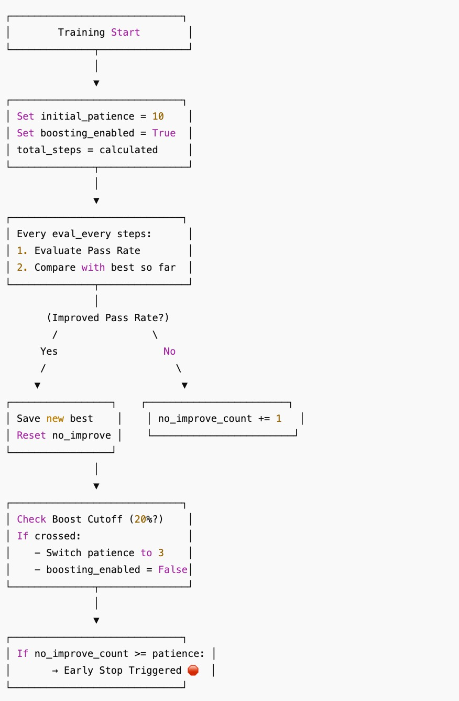

# Overcoming Deception of LLMs in Code-Generation using Supervised Fine-Tuning (SFT)

This repository contains code for our project focused on enhancing the robustness of large language models against deceptive code generation through supervised fine-tuning.

---

### 1. Installation

We recommend setting up a virtual environment:

```bash
conda create -n mislead python=3.10
conda activate mislead
pip install -e .
```

### 2. SFT Training 

To begin supervised fine-tuning, navigate to the appropriate directory and run:

```bash
cd src/programming
python train_sft.py
```

### 3. GPU Requirements
We rent out a GPU on VAST.ai with the following specifications:

<ul>
  <li>GPU: 1x NVIDIA A100 SXM4</li>
  <li>GPU Memory: 80 GB</li>
  <li>CUDA Version: 12.2</li>
  <li>Disk Space: 200 GB </li>
</ul>

### 4. Training pipeline
Below is a visual representation of the training pipeline:




3. Run Inference + Unit Testing (Interactive) - python inference_with_tests.py / python3 inference_with_tests.py
inside programming directory for testing our sft model.


You'll be able to:

  3.1) Input a natural language programming problem
  3.2) Generate Python code using your fine-tuned model
  3.3) Need to provide test cases as JSON input/output
  3.4) Get test results interactively

4. Run python inference_test_deepseek_instruct.py for testing original instruct model
